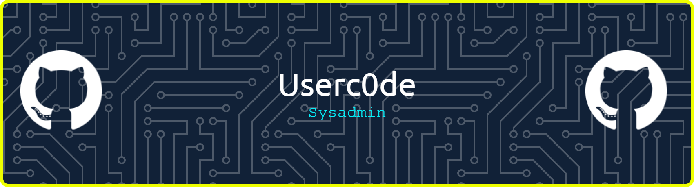

# 💫 About Me:
Pentester y sysadmin orientado a resultados, con foco en hardening, automatización y respuesta ante incidentes.  Combino pruebas de intrusión, ingeniería de redes y scripting en Python para detectar y mitigar riesgos en entornos híbridos y on‑premise  Lo que hago Pruebas de intrusión end‑to‑end: reconocimiento, explotación controlada y reporting accionable para equipos de TI y negocio.  Operación y hardening de infraestructura: Cisco/UniFi/Forti,Darktrace, servidores Linux/Windows, monitoreo y detección con Darktrace.  Automatización con Python: tooling para enumeración, parsers de logs, y utilidades de red para soporte a red/seguridad.  Intereses técnicos Red Team y Blue Team, escalada de privilegios en Linux, detección evasiva e ingeniería de tráfico.  Criptografía aplicada y ecosistema blockchain; curiosidad por historia de cifrados (Enigma y derivados).  Scripting reproducible, documentación clara y repositorios con tests y linters integrados.  Tecnología Redes y seguridad: Cisco, FortiGate/FortiSwitch, UniFi, segmentación, IDS/IPS, NAC, y monitoreo con Darktrace.  Sistemas: Linux y Windows Server, hardening, logging centralizado y tareas programadas de mantenimiento.  Lenguajes/Dev: Python (scripts de seguridad y automatización), integración con pipelines y control de versiones en Git.

## 🌐 Socials:
 

# 💻 Tech Stack:
      
# 📊 GitHub Stats:
 
 

---

<!-- Proudly created with GPRM ( https://gprm.itsvg.in ) -->
